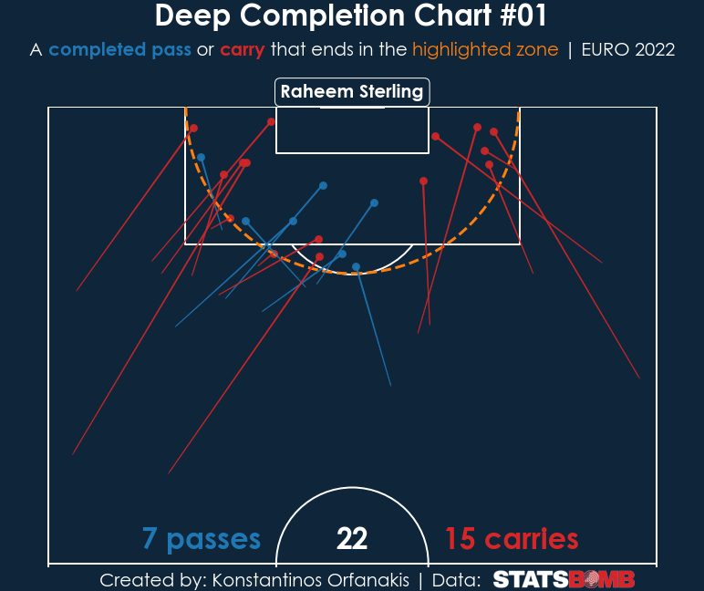

  

  A short tutorial on football analytics that demonstrates how to extract and visualise deep completions.

---

    
    
     

    
    
    
    
    
    
     

 

<!--ts-->
**Table of Contents:**
- [📌Motivation](#motivation)
- [🔍What are Deep Completions?](#what-are-deep-completions)
- [❓What Insights Can We Gain From This Type of Analysis/Visualisation?](#what-insights-can-we-gain-from-this-type-of-analysisvisualisation)
- [🙏Acknowledgements](#acknowledgements)
- [📞Feedback](#feedback)
<!--te-->

 

# 📌Motivation

In this project, we will learn how to use Python (version 3.6.8) to:

- Import open event data from [Statsbomb](https://statsbomb.com/)’s [GitHub repository](https://github.com/statsbomb/open-data), 
- Process the data to extract deep completion information, and 
- Visualise deep completions (to view some example figures, please visit the [Images folder](https://github.com/KOrfanakis/Deep_Completion_Charts/tree/main/Images)). 

The project is inspired by [CJ Mayes](https://cj-mayes.com/about/)’s collaboration with [Yash T](https://twitter.com/Odriozolite), 
published in the article '*[Creating a Deep Progression Chart with Yash T](https://cj-mayes.com/2022/01/05/deep-progression-chart-yash-t/)*'. 
I have included many of their visualisation elements in my final figure but made modifications to adjust the format to my style. 
I have also expanded on the data extraction and pre-processing steps, which was not the focus of CJ’s and Yash’s article.

This is my second project on football analytics. The first one,  titled '*[Football Match Summary Report](https://github.com/KOrfanakis/Football_Match_Summary_Report)*', demonstrates how to extract data from Understat and visualise a football match's summary (shot map + stats).

 

# 🔍What are Deep Completions?

To understand what a deep completion is, we start by defining a semi-circle with the centre at the mid-point of the goal and a radius equal to the width of the penalty area plus the penalty arc (see orange dashed line in Figure 1). 
A pass or carry is classified as a deep completion if it starts outside this region but ends inside it. 
Corners, free kicks, and incomplete passes are excluded from this analysis.

 

  

  <em>Figure 1: Deep completions (passes and carries) performed by Raheem Sterling in the Euro 2020.</em>

 

# ❓What Insights Can We Gain From This Type of Analysis/Visualisation?

[Yash](https://twitter.com/Odriozolite) perfectly described how analysing and visualising deep completions can help us. Below, I have included Yash’s response taken from their recent [article]((https://cj-mayes.com/2022/01/05/deep-progression-chart-yash-t/)):

*Football at its very basic is about scoring goals and maximising your team’s chances of scoring goals, and to that, you have to get the ball in areas that aid in that. 
Looking at deep completions helps us in that. The players highlighted in the chart are the ones that help do that via their passing or ball carrying. 
Looking deeper at it, we can further break it down to see what mode players tend to use when doing that, i.e. passing, carrying or crossing, and that can help us understand the playstyle of the players a little bit better.*

 

# 🙏Acknowledgements

Firstly, I would like to thank [Statsbomb](https://statsbomb.com/) for sharing their data and encouraging people to use them and share their insights. 
Additionally, I would like to thank [CJ](https://www.linkedin.com/in/cjmayes/) and [Yash](https://twitter.com/Odriozolite) for motivating me to look into deep completion charts. 
I used both their article and Jupyter notebook as guidelines for this project. 
Also, I used part of their code to create the football pitch and add deep completions with a few modifications to adjust it to my plotting style. 

 

# 📞Feedback

If you have any feedback or ideas to improve this project, feel free to contact me via:

